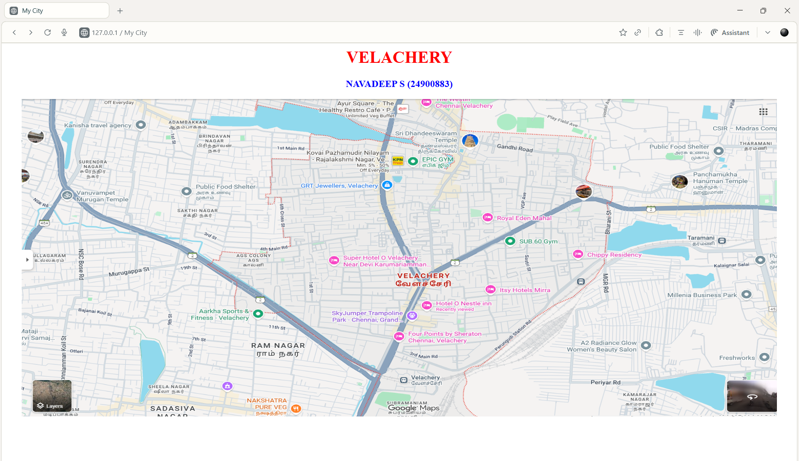
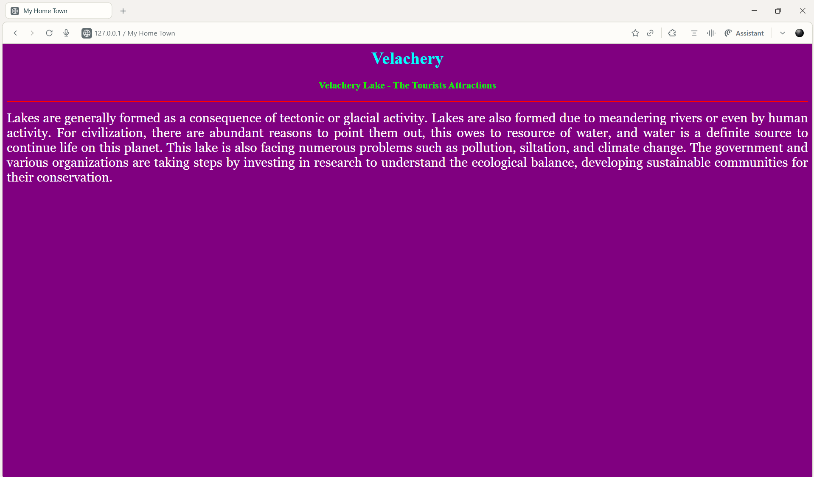
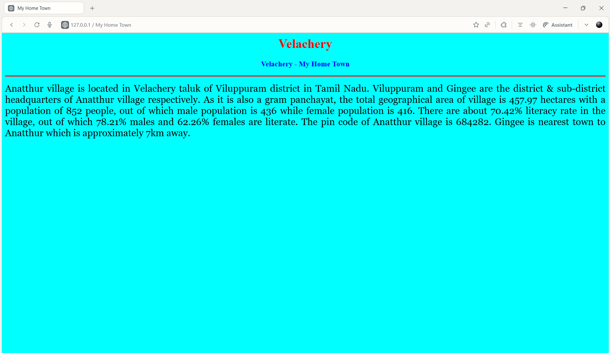
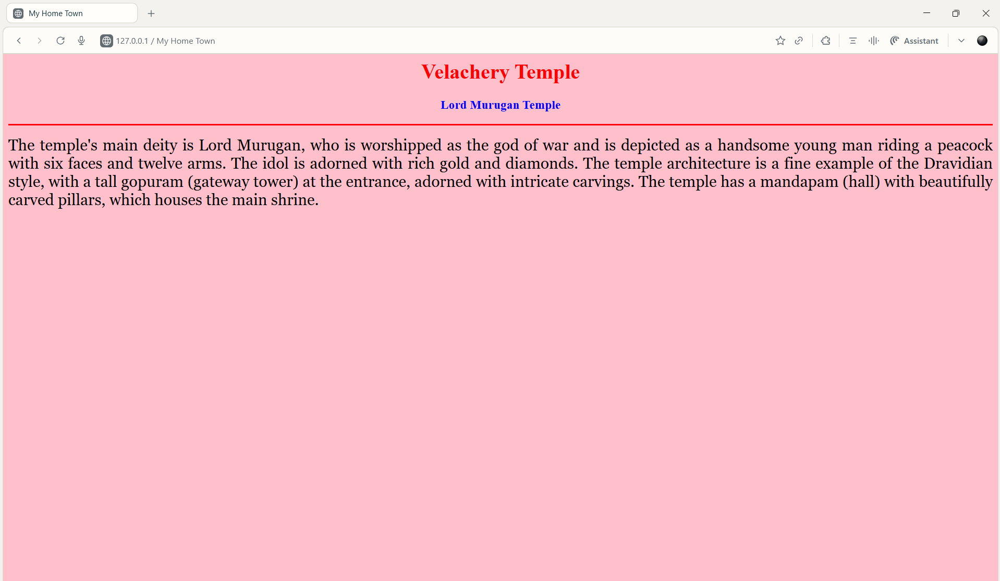
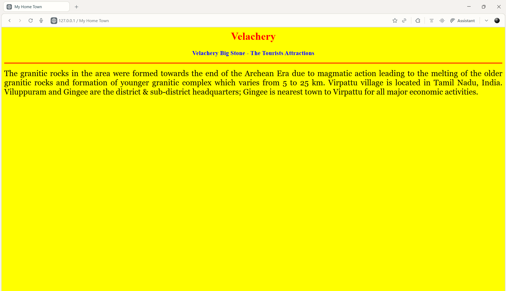

# Ex04 Places Around Me
## Date: 26.10.2025

## AIM
To develop a website to display details about the places around my house.

## DESIGN STEPS

### STEP 1
Create a Django admin interface.

### STEP 2
Download your city map from Google.

### STEP 3
Using ```<map>``` tag name the map.

### STEP 4
Create clickable regions in the image using ```<area>``` tag.

### STEP 5
Write HTML programs for all the regions identified.

### STEP 6
Execute the programs and publish them.

## CODE
```
map.html

<html>
<head>
    <title>My City</title>
</head>
<body>
    <h1 align="center">
        <font color="red"><b>VELACHERY</b></font>
    </h1>
    <h3 align="center">
        <font color="blue"><b>NAVADEEP S (24900883)</b></font>
    </h3>
    <center>
        
        <map name="MyCity">
            <area shape="rect" coords="700,250,850,400" href="ho.html" title="My Home Town">
            <area shape="circle" coords="450,200,30" href="temple.html" title="Balamurugan Temple">
            <area shape="circle" coords="640,200,40" href="lake.html" title="Anathur Lake">
            <area shape="rect" coords="600,250,850,400" href="stone.html" title="Virpattu Big Stone">
        </map>
    </center>
</body>
</html>

home.html

<html>
<head>
<title>My Home Town</title>
</head>
<body bgcolor="cyan">
<h1 align="center">
<font color="red"><b>Velachery</b></font>
</h1>
<h3 align="center">
<font color="blue"><b>Velachery - My Home Town</b></font>
</h3>
<hr size="3" color="red">
<p align="justify">
<font face="Georgia" size="5">
Anatthur village is located in Velachery taluk of Viluppuram district in Tamil Nadu. Viluppuram and Gingee are the district & sub-district headquarters of Anatthur village respectively. As it is also a gram panchayat, the total geographical area of village is 457.97 hectares with a population of 852 people, out of which male population is 436 while female population is 416. There are about 70.42% literacy rate in the village, out of which 78.21% males and 62.26% females are literate. The pin code of Anatthur village is 684282. Gingee is nearest town to Anatthur which is approximately 7km away.
</font>
</p>
</body>

lake.html

<html>
<head>
<title>My Home Town</title>
</head>
<body bgcolor="purple">
<h1 align="center">
<font color="cyan"><b>Velachery</b></font>
</h1>
<h3 align="center">
<font color="lime"><b>Velachery Lake - The Tourists Attractions</b></font>
</h3>
<hr size="3" color="red">
<p align="justify">
<font face="Georgia" size="5" color="white">
Lakes are generally formed as a consequence of tectonic or glacial activity. Lakes are also formed due to meandering rivers or even by human activity. For civilization, there are abundant reasons to point them out, this owes to resource of water, and water is a definite source to continue life on this planet. This lake is also facing numerous problems such as pollution, siltation, and climate change. The government and various organizations are taking steps by investing in research to understand the ecological balance, developing sustainable communities for their conservation.
</font>
</p>
</body>

stone.html

<html>
<head>
<title>My Home Town</title>
</head>
<body bgcolor="yellow">
<h1 align="center">
<font color="red"><b>Velachery</b></font>
</h1>
<h3 align="center">
<font color="blue"><b>Velachery Big Stone - The Tourists Attractions</b></font>
</h3>
<hr size="3" color="red">
<p align="justify">
<font face="Georgia" size="5">
The granitic rocks in the area were formed towards the end of the Archean Era due to magmatic action leading to the melting of the older granitic rocks and formation of younger granitic complex which varies from 5 to 25 km. Virpattu village is located in Tamil Nadu, India. Viluppuram and Gingee are the district & sub-district headquarters; Gingee is nearest town to Virpattu for all major economic activities.
</font>
</p>
</body>
</html>

```


## OUTPUT







## RESULT
The program for implementing image maps using HTML is executed successfully.
